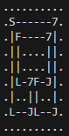
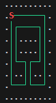
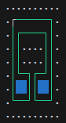

# Adevent of Code 2023
These are my attempts at [Advent of Code 2023](https://adventofcode.com/2023). I'm doing this in C++, my main programming language.

Usually, I just try to get to the solution quick and dirty, but I am also practicing with ranges while I'm at it.

Also, this repository is demonstrating how to work in a [VSCode Dev container](https://code.visualstudio.com/docs/devcontainers/containers). The dev container is custom built from this [Dockerfile](https://github.com/pgit/cpp-devcontainer/blob/main/Dockerfile) and includes latest LLVM, boost and some other libraries. C++ IntelliSense is based on [clangd](https://clangd.llvm.org/) and [this plugin](https://marketplace.visualstudio.com/items?itemName=llvm-vs-code-extensions.vscode-clangd). Debugging works as well, with [lldb](https://marketplace.visualstudio.com/items?itemName=vadimcn.vscode-lldb).

## [Day 3](https://adventofcode.com/2023/day/3) [(code)](src/3ab.cpp)

Added empty rows and columns around the actual input array, to avoid the proverbial border cases.

## [Day 4](https://adventofcode.com/2023/day/4) [(code)](src/4ab.cpp)

I like [this one](src/4ab.cpp) because there is a nice feature of [boost::regex](https://www.boost.org/doc/libs/1_83_0/libs/regex/doc/html/index.html) allowing a capture to happen multiple times, if that capture is part of a repeated sub-expression.

```c++
boost::regex regexp{R"(Card +(\d+):(?: +(\d+))+ \|(?: +(\d+))+)"};
boost::smatch what;
boost::regex_match(line, what, regexp, boost::match_extra | boost::match_perl);
auto winning_numbers = what[2].captures() |
   transform([](auto s) { return std::stoi(s.str()); }) |
   ranges::to<std::set>;
```

Note: For the objectives, the actual numeric values on the cards are never used, so we wouldn't even need to to do `stoi` here.

The inner `(\d+)` capture group is repeated because it is embeded in a non-capturing group `(?: +(\d+))+`, which maches `" 1 12 13 14"` four times and can be extracted using by calling `captures()` on the match. That object has `begin()` and `end()` functions and interacts nicely with ranges.

Also, for the second part, the extra copies of the cards are handled using a `std::deque` look-ahead in an efficient manner.

## [Day 7](https://adventofcode.com/2023/day/7) [(code)](src/7ab.cpp)

Clean core function to compute the hand 'type': Note that the `hand` is already sorted according to card value:

```c++
// '2' => 2, ..., 'T' => 10, ...
auto to_valueA = transform([](auto c) -> int { return "..23456789TJQKA"sv.find(c); });

// 'J' => 0, '2' => 2, ...
auto to_valueB = transform([](auto c) -> int { return "J.23456789T.QKA"sv.find(c); });
```

 For Part II, the Joker gets special value 0.
```c++
Type computeType()
{
   // hand   = [14, 2, 0, 14, 12]

   auto unique = hand | filter([](auto c) { return c != 0; }) | to<std::set>;
   auto hist = unique | transform([&](int card) { return count(hand, card); }) | to<std::vector>;
   sort(hist);
   auto jokers = count(hand, 0);

   // unique = {2, 14, 12}
   // hist   = [1, 1, 2]
   // jokers = 1

   if (unique.size() <= 1) // may also be all jokers
      return Type::five_of_a_kind; // 5
   else if (unique.size() == 2)
   {
      if (hist[1] + jokers == 4)
         return Type::four_of_a_kind; // 1, 4
      else
         return Type::full_house; // 2, 3
   }
   else if (unique.size() == 3)
   {
      if (hist[2] + jokers == 3)
         return Type::three_of_a_kind; // 1, 1, 3
      else
         return Type::two_pair; // 1, 2, 2
   }
   else if (unique.size() == 4)
      return Type::one_pair; // 1, 1, 1, 2
   else
      return Type::high_card; // 1, 1, 1, 1, 1
}
```

## [Day 8](https://adventofcode.com/2023/day/8) [(code)](src/8ab.cpp)

As [others on reddit](https://www.reddit.com/r/adventofcode/comments/18df7px/2023_day_8_solutions/), I did not like part II of today very much. I think the input is constructed in a very specific, non-general way for the solution to work as it does.

Anyway, I learned about [Boost.Integer LCM](https://www.boost.org/doc/libs/1_83_0/libs/integer/doc/html/boost_integer/gcd_lcm.html) and notably `lcm_range`, which computes LCM not just of two integeres, but a whole range.

## [Day 9](https://adventofcode.com/2023/day/9) [(code)](src/9ab.cpp)

Finally, an easy one again. Things I learned today:

With [ranges::views::istream](https://ericniebler.github.io/range-v3/istream_8hpp.html), you can easily parse a sequence of numbers, with less overhead than the regexp method mentioned before.
```c++
std::istringstream ss{line};
auto numbers = istream<long>(ss) | ranges::to<std::vector>;
```
This is also possible with the file stream directly, but that would ignore the newlines. And as with most AoC code, no error checking.

## [Day 10](https://adventofcode.com/2023/day/10) [(code)](src/10ab.cpp)

This puzzle involves a system of Pipes, encoded by characters `-`, `|`, `F`, `J`, `L`, `7` and `.` as noted in the [puzzle description](https://adventofcode.com/2023/day/10). With UNICODE line drawing characters, this looks much nicer:





First map shows an example input with the starting point `S`. The second one is an example solution for Part B, resulting in 4 enclosed tiles.

Part B can be done with a straighforward scan line algorithm that goes through each row of the map and toggles a flag between being *inside* or *outside* the loop. This is obvious when encountering a `│`  sign. But for and of `─`, `└`, `┘`, `┐` and `┌` it is a bit more complicated:

When scanning a line, besides the `|` you can only ever encounter a `└` or `┌`, or there there is somehting wrong with the loop. If the `└` ends with an `┘`, the *inside*-flag doesn't change. But if it ends with an `┐`, it does.

So all 5 situations in which the *inside* flag needs to change are:

* `|`
* `┌┄┄┄┄┘`  (zero or more horizontal lines)
* `└┄┄┄┄┐` (zero or more horizontal lines)

Then, it's only about counting `.` while *inside* is true.

## [Day 14](https://adventofcode.com/2023/day/14) [(code)](src/14ab.cpp)

This day involved a map again, to which a *slide* operation is applied in one of the four directions N, W, S, E. This is solved by creating a rotated `View` on the map, allowing the sliding algorithm to operate uniformly.

The solution is rather complicated, but I learned how to create custom *row* and *column* iterators that support ranges. 

When creating custom ranges that are a *view* of some referenced data, it is important to make it a [borrowed range](https://en.cppreference.com/w/cpp/ranges/borrowed_range). Otherwise, you will not be able to work with an rvalue of it:

```c++
size_t weight(Direction dir)
{
   return accumulate(view(dir) | transform(&Row::weight), size_t{0});
}
```

`view(dir)` returns a non-owning view of the map, over which you can iterate to get the rows as viewed by the given direction.

## [Day 16](https://adventofcode.com/2023/day/16) [(code)](src/16ab.cpp)

With a class modelling a pair of signed Coordinates `(x, y)`, the main loop boils down to

```c++
void trace(Coord pos, Coord dir)
{
   for (;;)
   {
      pos += dir;
      ...
   }
}
```
and then changing `dir` depending on the current symbal at `pos`:

* On a `\`, the direction is transposed, meaning x and y coordinates are swapped.
* On a `/`, it's the same, but the coordinates are also negated.
* The pipe symbols `-` and `|` split the ray into two and are followed using recursion.